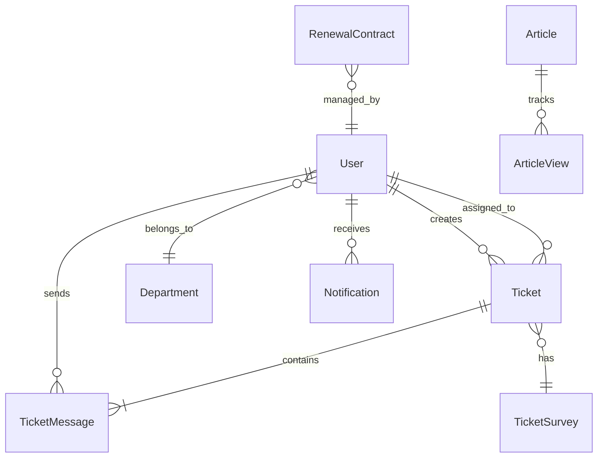

# 🔍 iDesk System Review - Comprehensive Analysis

> **Document Type:** System Analysis & Strategic Recommendations  
> **Generated:** 2025-12-06  
> **Scope:** Full-Stack Enterprise Helpdesk System

---

## Table of Contents

1. [Executive Summary](#1-executive-summary)
2. [Current System Overview](#2-current-system-overview)
3. [Gap Analysis & Improvement Areas](#3-gap-analysis--improvement-areas)
4. [Feature Recommendations by Role](#4-feature-recommendations-by-role)
5. [Implementation Phases](#5-implementation-phases)
6. [Technical Recommendations](#6-technical-recommendations)

---

## 1. Executive Summary

**iDesk** adalah sistem helpdesk enterprise yang dibangun dengan arsitektur modern menggunakan **NestJS** (Backend) dan **React + Vite** (Frontend). Sistem ini sudah memiliki fitur-fitur core yang solid, namun ada beberapa area yang dapat ditingkatkan untuk mencapai standar industri.

### ✅ Kekuatan Saat Ini
- Arsitektur Clean Architecture dengan Domain-Driven Design
- 13 backend modules yang terstruktur dengan baik
- Real-time updates via Socket.io
- Glassmorphism UI yang modern
- Integrasi Telegram Bot yang interaktif
- SLA Management dengan automated monitoring
- Knowledge Base dengan search functionality

### ⚠️ Area yang Perlu Diperhatikan
- Tidak ada Email-to-Ticket integration
- Workflow automation engine belum ada
- Asset Management (CMDB) belum tersedia
- Time tracking untuk billing belum ada
- Multi-language support belum ada

---

## 2. Current System Overview

### 2.1 Backend Architecture

```
┌─────────────────────────────────────────────────────────────┐
│                    BACKEND MODULES (13)                       │
├─────────────────────────────────────────────────────────────┤
│ ┌─────────────┐  ┌─────────────┐  ┌─────────────────────┐   │
│ │    Auth     │  │   Users     │  │     Ticketing       │   │
│ │  JWT+RBAC   │  │  CRUD+CSV   │  │  Lifecycle+SLA      │   │
│ └─────────────┘  └─────────────┘  └─────────────────────┘   │
│ ┌─────────────┐  ┌─────────────┐  ┌─────────────────────┐   │
│ │  Knowledge  │  │ Notifications│ │      Reports        │   │
│ │    Base     │  │Multi-Channel│  │   PDF/Excel Gen     │   │
│ └─────────────┘  └─────────────┘  └─────────────────────┘   │
│ ┌─────────────┐  ┌─────────────┐  ┌─────────────────────┐   │
│ │  Telegram   │  │   Search    │  │      Renewal        │   │
│ │  Bot+Chat   │  │ Unified+Save│  │  Contract Mgmt      │   │
│ └─────────────┘  └─────────────┘  └─────────────────────┘   │
│ ┌─────────────┐  ┌─────────────┐  ┌─────────────────────┐   │
│ │   Audit     │  │   Uploads   │  │      Health         │   │
│ │   Logging   │  │ File Mgmt   │  │  System Checks      │   │
│ └─────────────┘  └─────────────┘  └─────────────────────┘   │
└─────────────────────────────────────────────────────────────┘
```

#### Module Details

| Module | Purpose | Status |
|--------|---------|--------|
| **Auth** | JWT authentication dengan RBAC (ADMIN, AGENT, USER) | ✅ Complete |
| **Users** | User CRUD, CSV import, avatar, Telegram linking | ✅ Complete |
| **Ticketing** | Ticket lifecycle, SLA, surveys, templates | ✅ Complete |
| **Knowledge Base** | Articles, search, view tracking | ✅ Complete |
| **Notifications** | Email, in-app, Telegram notifications | ✅ Complete |
| **Reports** | PDF/Excel generation, analytics | ✅ Complete |
| **Renewal** | Contract management, PDF extraction | ✅ Complete |
| **Telegram** | Bot integration, interactive menus | ✅ Complete |
| **Search** | Unified search, saved searches | ✅ Complete |
| **SLA Config** | Priority-based SLA definitions | ✅ Complete |
| **Audit** | Activity logging | ✅ Complete |
| **Uploads** | File management | ✅ Complete |
| **Health** | System health checks | ✅ Complete |

### 2.2 Frontend Architecture

```
┌─────────────────────────────────────────────────────────────┐
│                   FRONTEND FEATURES (12)                      │
├─────────────────────────────────────────────────────────────┤
│ ┌───────────────┐  ┌───────────────┐  ┌─────────────────┐   │
│ │   Dashboard   │  │ Ticket Board  │  │      Auth       │   │
│ │  Bento Stats  │  │ Kanban+List   │  │  Login/Register │   │
│ └───────────────┘  └───────────────┘  └─────────────────┘   │
│ ┌───────────────┐  ┌───────────────┐  ┌─────────────────┐   │
│ │    Client     │  │     Admin     │  │ Knowledge Base  │   │
│ │  Portal+Notif │  │  User Mgmt    │  │   Articles      │   │
│ └───────────────┘  └───────────────┘  └─────────────────┘   │
│ ┌───────────────┐  ┌───────────────┐  ┌─────────────────┐   │
│ │    Reports    │  │    Renewal    │  │    Settings     │   │
│ │   Analytics   │  │  Contracts    │  │    Profile      │   │
│ └───────────────┘  └───────────────┘  └─────────────────┘   │
│ ┌───────────────┐  ┌───────────────┐  ┌─────────────────┐   │
│ │    Search     │  │ Notifications │  │     Public      │   │
│ │   Global      │  │    Center     │  │   Pages         │   │
│ └───────────────┘  └───────────────┘  └─────────────────┘   │
└─────────────────────────────────────────────────────────────┘
```

#### UI Component Library (44+ Components)

**Core Components:**
- `button`, `card`, `dialog`, `input`, `select`, `table`, `checkbox`, `popover`, `progress`

**Advanced Components:**
- `CommandPalette` - Global search/command interface
- `RichTextEditor` - WYSIWYG editor
- `VirtualizedList` - Performance-optimized lists
- `ActivityFeed` - Real-time activity display
- `Sparkline` - Inline charts
- `SwipeableRow` - Mobile gesture support
- `PullToRefresh` - Mobile refresh pattern
- `CannedResponses` - Quick reply templates
- `ArticleSearchAutocomplete` - KB search

### 2.3 Data Model Overview



---

## 3. Gap Analysis & Improvement Areas

### 3.1 🔴 Critical Issues (Perlu Segera Diperbaiki)

| Issue | Location | Impact | Recommendation |
|-------|----------|--------|----------------|
| Console Logging in Production | `jwt-auth.guard.ts:25-27` | Security risk - debug info exposed | Replace with structured logging via Logger service |
| Hardcoded Admin Email | `sla-checker.service.ts:132` | Configuration inflexibility | Move to ConfigService |
| LocalStorage Token Storage | `api.ts:12` | XSS vulnerability | Consider httpOnly cookies or encrypt tokens |
| Missing CSRF Protection | API Layer | Session hijacking risk | Add CSRF tokens for state-changing operations |

### 3.2 🟠 Performance Bottlenecks

| Issue | Impact | Solution |
|-------|--------|----------|
| N+1 Query Risk pada Dashboard Stats | Slow dashboard loading | Implement SQL aggregation queries |
| Full Messages Loaded with Ticket | High memory usage | Implement message pagination |
| WebSocket Reconnection Loops | Server flooding | Add exponential backoff |
| Uncached Article Views | Database overload | Add Redis caching for view counts |

### 3.3 🟡 Architecture Improvements

| Area | Current State | Recommended State |
|------|---------------|-------------------|
| Error Handling | Inconsistent (mix of custom & generic exceptions) | Standardized exception filter with error codes |
| Repository Layer | Direct TypeORM injection | Abstract repository interfaces |
| Architecture Pattern | Mixed (ticketing=DDD, auth=flat) | Consistent DDD across all modules |
| Optimistic Locking | Partially implemented | Full implementation across all entities |

### 3.4 Frontend Gaps

| Gap | Impact | Priority |
|-----|--------|----------|
| No Offline Support | Poor mobile experience | Medium |
| Missing Skeleton Loaders for Charts | Poor UX during loading | Low |
| Form Validation Inconsistency | User confusion | Medium |
| Accessibility Gaps | WCAG non-compliance | High |

---

## 4. Feature Recommendations by Role

### 4.1 👤 User (End User/Customer) Features

#### Existing Features ✅
- Create tickets via Web portal
- Create tickets via Telegram Bot
- View own ticket history
- Search Knowledge Base
- Receive status notifications (Email + Telegram)
- Fill satisfaction surveys

#### Recommended New Features 🆕

| Feature | Description | Priority | Effort |
|---------|-------------|----------|--------|
| **Magic Link Login** | Login tanpa password via email link | 🔴 High | Medium |
| **Ticket Portal Public** | Track ticket status tanpa login (via ticket number + token) | 🔴 High | Medium |
| **Multi-language Support** | UI dalam Bahasa Indonesia & English | 🟠 Med | High |
| **WhatsApp Integration** | Create & track tickets via WhatsApp | 🟠 Med | High |
| **Mobile PWA Improvements** | Offline viewing, push notifications | 🟠 Med | Medium |
| **File Preview** | Preview PDF/images dalam chat tanpa download | 🟡 Low | Low |
| **Voice Message** | Kirim voice note di ticket | 🟡 Low | Medium |
| **AI Chatbot** | Self-service troubleshooting sebelum create ticket | 🟠 Med | High |

### 4.2 🛠️ Agent (Support Staff) Features

#### Existing Features ✅
- Kanban Board view
- List view dengan sorting/filtering
- Real-time ticket updates
- Chat interface dengan attachments
- Canned responses
- Mention other agents
- Knowledge Base access
- SLA indicators

#### Recommended New Features 🆕

| Feature | Description | Priority | Effort |
|---------|-------------|----------|--------|
| **Time Tracking** | Track time spent per ticket (start/stop timer) | 🔴 High | Medium |
| **Ticket Collision Alert** | Warning ketika 2 agent edit ticket yang sama | 🔴 High | Medium |
| **@mention Notifications** | Push notif ketika di-mention dalam ticket | 🔴 High | Low |
| **Ticket Merge** | Gabungkan duplicate tickets | 🟠 Med | Medium |
| **Split Ticket** | Pecah 1 ticket jadi multiple tickets | 🟠 Med | Medium |
| **Email-to-Ticket** | Reply ticket via email | 🔴 High | High |
| **Internal Notes Privacy** | Notes yang tidak bisa dilihat customer | 🔴 High | Low |
| **Ticket Snooze** | Hide ticket temporarily dan muncul lagi nanti | 🟠 Med | Medium |
| **Quick Actions Hotkeys** | Keyboard shortcuts untuk common actions | 🟡 Low | Low |
| **Sentiment Analysis** | AI detect customer emotion dari message | 🟡 Low | High |
| **Asset Linking** | Link ticket ke specific device/asset | 🟠 Med | Medium |
| **Screen Recording** | Record screen untuk troubleshooting | 🟡 Low | Medium |

### 4.3 👔 Administrator Features

#### Existing Features ✅
- User management (CRUD)
- CSV import users
- Role management
- Department management
- SLA configuration
- Reports (PDF/Excel)
- Knowledge Base management (CRUD articles)
- Telegram Bot configuration

#### Recommended New Features 🆕

| Feature | Description | Priority | Effort |
|---------|-------------|----------|--------|
| **Workflow Automation Engine** | Custom rules: IF condition THEN action | 🔴 High | High |
| **Email-to-Ticket Config** | Setup email inbox untuk auto-create tickets | 🔴 High | High |
| **Asset Management (CMDB)** | Inventory hardware/software | 🟠 Med | High |
| **Custom Fields** | Define custom ticket fields per category | 🔴 High | Medium |
| **Scheduled Reports** | Auto-generate & email reports weekly/monthly | 🟠 Med | Medium |
| **Audit Log Viewer** | UI untuk view semua audit logs | 🟠 Med | Low |
| **System Health Dashboard** | Monitor system performance | 🟠 Med | Medium |
| **Business Hours Config** | Define working hours untuk SLA calculation | 🔴 High | Medium |
| **Escalation Matrix** | Auto-escalate based on time/priority | 🔴 High | High |
| **Approval Workflows** | Multi-level approval untuk certain tickets | 🟠 Med | High |
| **License Management** | Track software licenses & expiry | 🟡 Low | Medium |
| **Integration Webhooks** | HTTP callbacks untuk integrate dengan external systems | 🟠 Med | Medium |
| **Bulk Ticket Operations** | Mass update/close/assign tickets | 🔴 High | Low |
| **Agent Performance Dashboard** | Detailed metrics per agent | 🟠 Med | Medium |
| **Ticket Routing Rules** | Auto-assign based on category/keywords | 🔴 High | Medium |

---

## 5. Implementation Phases

### 📋 Phase 1: Foundation & Quick Wins (2-3 Weeks)

**Fokus:** Perbaiki critical issues dan tambahkan fitur high-impact low-effort

```
┌──────────────────────────────────────────────────────────────────┐
│                     PHASE 1: FOUNDATION                           │
├──────────────────────────────────────────────────────────────────┤
│ Week 1-2:                                                         │
│ ├── 🔧 Security Fixes                                             │
│ │   ├── Remove console.log in production                         │
│ │   ├── Externalize hardcoded config values                      │
│ │   └── Add structured logging                                    │
│ │                                                                 │
│ ├── 🎯 Quick Wins                                                 │
│ │   ├── Internal Notes (private notes feature)                   │
│ │   ├── Bulk Ticket Operations (mass close/assign)               │
│ │   └── Keyboard shortcuts for common actions                    │
│ │                                                                 │
│ └── 📊 Performance                                                │
│     ├── Dashboard stats SQL aggregation                          │
│     ├── Message pagination                                        │
│     └── Redis caching for KB views                                │
│                                                                   │
│ Week 3:                                                           │
│ ├── Business Hours Configuration                                  │
│ ├── SLA calculation adjustment for business hours                 │
│ └── Testing & QA                                                  │
└──────────────────────────────────────────────────────────────────┘
```

**Deliverables:**
- [x] Security vulnerabilities fixed ✅ (console.log removed, structured logging added)
- [x] Internal notes feature ✅ (Backend + Frontend)
- [x] Bulk operations UI ✅ (BulkActionsToolbar component)
- [x] Business hours config ✅ (Indonesian holidays 2025-2026)
- [x] Performance improvements ✅ (Message pagination, SQL aggregation)

---

### 📧 Phase 2: Email Integration (2-3 Weeks)

**Fokus:** Email-to-Ticket adalah gap paling kritis vs kompetitor

```
┌──────────────────────────────────────────────────────────────────┐
│                 PHASE 2: EMAIL INTEGRATION                        │
├──────────────────────────────────────────────────────────────────┤
│ Week 4-5:                                                         │
│ ├── Email Parser Module                                           │
│ │   ├── IMAP connection / Webhook (SendGrid/Mailgun)             │
│ │   ├── Email parsing (subject → title, body → description)     │
│ │   ├── Attachment handling                                       │
│ │   └── Thread matching (reply → existing ticket)                │
│ │                                                                 │
│ ├── Admin Configuration UI                                        │
│ │   ├── Email inbox settings                                     │
│ │   ├── Auto-assignment rules                                     │
│ │   └── Notification templates                                    │
│ │                                                                 │
│ └── Agent Features                                                │
│     └── Reply via email (outbound email replies)                 │
│                                                                   │
│ Week 6:                                                           │
│ ├── Email notification improvements                               │
│ ├── Testing with real email flows                                 │
│ └── Documentation                                                 │
└──────────────────────────────────────────────────────────────────┘
```

**Deliverables:**
- [ ] Email-to-Ticket auto-creation
- [ ] Reply threading
- [ ] Admin email configuration UI
- [ ] Agent email reply capability

---

### ⚡ Phase 3: Automation Engine (3-4 Weeks)

**Fokus:** Workflow automation untuk reduce manual work

```
┌──────────────────────────────────────────────────────────────────┐
│                 PHASE 3: AUTOMATION ENGINE                        │
├──────────────────────────────────────────────────────────────────┤
│ Week 7-8:                                                         │
│ ├── Workflow Engine Core                                          │
│ │   ├── Rule schema design (trigger → condition → action)       │
│ │   ├── Event-driven execution via @nestjs/event-emitter         │
│ │   ├── Rule storage & versioning                                 │
│ │   └── Rule priority & ordering                                  │
│ │                                                                 │
│ ├── Built-in Triggers                                             │
│ │   ├── Ticket created                                            │
│ │   ├── Ticket status changed                                     │
│ │   ├── Ticket priority changed                                   │
│ │   ├── Message received                                          │
│ │   ├── SLA breach imminent                                       │
│ │   └── Ticket idle for X hours                                   │
│ │                                                                 │
│ └── Built-in Actions                                              │
│     ├── Send notification                                         │
│     ├── Change assignee                                           │
│     ├── Change priority                                           │
│     ├── Change status                                             │
│     ├── Add tag/label                                             │
│     └── Send webhook                                              │
│                                                                   │
│ Week 9-10:                                                        │
│ ├── Visual Rule Builder UI                                        │
│ ├── Rule testing sandbox                                          │
│ ├── Escalation Matrix implementation                              │
│ └── Auto-assignment routing rules                                 │
└──────────────────────────────────────────────────────────────────┘
```

**Deliverables:**
- [x] Workflow engine backend ✅ (WorkflowEngine, ConditionEvaluator, ActionExecutor)
- [x] Visual rule builder UI ✅ (AutomationRulesPage with template support)
- [x] 10+ pre-built automation templates ✅ (5 templates included)
- [ ] Escalation matrix (partial - via workflow rules)
- [x] Auto-routing rules ✅ (ROUND_ROBIN, LEAST_BUSY assignment types)

---

### 🖥️ Phase 4: Asset Management (3-4 Weeks)

**Fokus:** CMDB untuk tracking hardware/software

```
┌──────────────────────────────────────────────────────────────────┐
│                 PHASE 4: ASSET MANAGEMENT                         │
├──────────────────────────────────────────────────────────────────┤
│ Week 11-12:                                                       │
│ ├── Asset Module                                                  │
│ │   ├── Asset entity (type, serial, model, status, owner)       │
│ │   ├── Asset categories (Hardware, Software, License)          │
│ │   ├── Asset lifecycle states                                   │
│ │   └── Asset-User relationships                                 │
│ │                                                                 │
│ ├── Asset-Ticket Integration                                      │
│ │   ├── Link tickets to assets                                   │
│ │   ├── Asset history on ticket                                  │
│ │   └── Auto-suggest assets based on user                        │
│ │                                                                 │
│ └── Import/Export                                                 │
│     ├── CSV import                                                │
│     └── Excel export                                              │
│                                                                   │
│ Week 13-14:                                                       │
│ ├── Asset Dashboard                                               │
│ │   ├── Asset inventory overview                                 │
│ │   ├── Expiring warranties                                      │
│ │   └── Asset utilization reports                                │
│ │                                                                 │
│ └── License Management                                            │
│     ├── License tracking                                          │
│     ├── Expiry alerts                                             │
│     └── Compliance reports                                        │
└──────────────────────────────────────────────────────────────────┘
```

**Deliverables:**
- [ ] Asset management module
- [ ] Asset-ticket linking
- [ ] License tracking
- [ ] Asset reports

---

### ⏱️ Phase 5: Time Tracking & Analytics (2-3 Weeks)

**Fokus:** Time tracking untuk billing & performance

```
┌──────────────────────────────────────────────────────────────────┐
│                 PHASE 5: TIME TRACKING                            │
├──────────────────────────────────────────────────────────────────┤
│ Week 15-16:                                                       │
│ ├── Time Entry Module                                             │
│ │   ├── TimeEntry entity                                         │
│ │   ├── Start/stop timer                                         │
│ │   ├── Manual time entry                                        │
│ │   └── Billable vs non-billable                                 │
│ │                                                                 │
│ ├── Timer UI                                                      │
│ │   ├── Ticket detail timer widget                               │
│ │   ├── Global timer (floating)                                  │
│ │   └── Time log history                                         │
│ │                                                                 │
│ └── Reports                                                       │
│     ├── Time per ticket/project                                  │
│     ├── Time per agent                                           │
│     └── Billable hours export                                    │
│                                                                   │
│ Week 17:                                                          │
│ ├── Agent Performance Dashboard enhancement                       │
│ ├── SLA metrics with time tracking                                │
│ └── QA & Documentation                                            │
└──────────────────────────────────────────────────────────────────┘
```

**Deliverables:**
- [ ] Time tracking module
- [ ] Timer UI components
- [ ] Time reports
- [ ] Enhanced agent performance metrics

---

### 🌐 Phase 6: Multi-Channel & AI (4-6 Weeks)

**Fokus:** Expand channels & add AI capabilities

```
┌──────────────────────────────────────────────────────────────────┐
│                 PHASE 6: MULTI-CHANNEL & AI                       │
├──────────────────────────────────────────────────────────────────┤
│ Week 18-19:                                                       │
│ ├── WhatsApp Integration                                          │
│ │   ├── WhatsApp Business API setup                              │
│ │   ├── Ticket creation via WhatsApp                             │
│ │   ├── Two-way messaging                                        │
│ │   └── Media handling                                           │
│                                                                   │
│ Week 20-21:                                                       │
│ ├── AI Features                                                   │
│ │   ├── Auto-categorization (OpenAI/local LLM)                   │
│ │   ├── Priority suggestion                                      │
│ │   ├── Response suggestions                                     │
│ │   ├── Sentiment analysis                                       │
│ │   └── KB article suggestions                                   │
│                                                                   │
│ Week 22-23:                                                       │
│ ├── AI Chatbot (Customer-facing)                                  │
│ │   ├── Self-service troubleshooting                             │
│ │   ├── FAQ answering                                            │
│ │   └── Escalation to human                                      │
│ │                                                                 │
│ └── Multi-language Support                                        │
│     ├── i18n setup                                               │
│     ├── Indonesian + English                                     │
│     └── Language selector                                        │
└──────────────────────────────────────────────────────────────────┘
```

**Deliverables:**
- [ ] WhatsApp integration
- [ ] AI ticket classification
- [ ] AI response suggestions
- [ ] Self-service chatbot
- [ ] Multi-language UI

---

## 6. Technical Recommendations

### 6.1 Security Improvements

```typescript
// 1. Replace console.log with Logger
// Before (jwt-auth.guard.ts):
console.log('JwtAuthGuard Error:', err);

// After:
this.logger.debug('Auth failure', { error: err?.message, info });
```

```typescript
// 2. Externalize configuration
// Before (sla-checker.service.ts):
const adminEmail = 'admin@antigravity.com';

// After:
const adminEmail = this.configService.get<string>('SLA_ADMIN_EMAIL');
```

### 6.2 Performance Optimizations

```typescript
// Dashboard stats aggregation (instead of loading all tickets)
async getDashboardStats(): Promise<DashboardStats> {
    return this.ticketRepo
        .createQueryBuilder('t')
        .select([
            'COUNT(*) as total',
            `SUM(CASE WHEN t.status = 'TODO' THEN 1 ELSE 0 END) as open`,
            `SUM(CASE WHEN t.status = 'IN_PROGRESS' THEN 1 ELSE 0 END) as inProgress`,
            `SUM(CASE WHEN t.isOverdue = true THEN 1 ELSE 0 END) as overdue`,
        ])
        .getRawOne();
}
```

### 6.3 Recommended New Entities

```typescript
// TimeEntry entity untuk time tracking
@Entity('time_entries')
export class TimeEntry {
    @PrimaryGeneratedColumn('uuid')
    id: string;

    @Column()
    ticketId: string;

    @Column()
    userId: string;

    @Column()
    startedAt: Date;

    @Column({ nullable: true })
    endedAt: Date;

    @Column({ type: 'int', default: 0 })
    durationMinutes: number;

    @Column({ default: false })
    isBillable: boolean;

    @Column({ nullable: true })
    description: string;
}
```

```typescript
// Asset entity untuk CMDB
@Entity('assets')
export class Asset {
    @PrimaryGeneratedColumn('uuid')
    id: string;

    @Column()
    assetTag: string;

    @Column()
    name: string;

    @Column({ type: 'enum', enum: AssetType })
    type: AssetType;

    @Column({ nullable: true })
    serialNumber: string;

    @Column({ nullable: true })
    manufacturer: string;

    @Column({ nullable: true })
    model: string;

    @Column({ type: 'enum', enum: AssetStatus })
    status: AssetStatus;

    @Column({ nullable: true })
    assignedToId: string;

    @Column({ nullable: true })
    purchaseDate: Date;

    @Column({ nullable: true })
    warrantyExpiry: Date;
}
```

```typescript
// WorkflowRule entity untuk automation
@Entity('workflow_rules')
export class WorkflowRule {
    @PrimaryGeneratedColumn('uuid')
    id: string;

    @Column()
    name: string;

    @Column({ default: true })
    isActive: boolean;

    @Column({ type: 'int', default: 1 })
    priority: number;

    @Column({ type: 'jsonb' })
    trigger: WorkflowTrigger;

    @Column({ type: 'jsonb' })
    conditions: WorkflowCondition[];

    @Column({ type: 'jsonb' })
    actions: WorkflowAction[];
}
```

### 6.4 Architecture Consistency Recommendations

1. **Standardize Module Structure:**
   ```
   modules/
   └── [module-name]/
       ├── domain/
       │   ├── entities/
       │   └── interfaces/
       ├── infrastructure/
       │   ├── repositories/
       │   └── adapters/
       ├── application/
       │   └── services/
       └── presentation/
           ├── controllers/
           └── dto/
   ```

2. **Create Abstract Repository Interfaces:**
   - Decouple services from TypeORM
   - Easier to test & swap implementations

3. **Standardize Error Codes:**
   ```typescript
   export enum ErrorCode {
       TICKET_NOT_FOUND = 'TICKET_001',
       SLA_BREACH = 'SLA_001',
       UNAUTHORIZED = 'AUTH_001',
       // ...
   }
   ```

---

## Summary & Prioritization Matrix

### Prioritization Matrix

| Priority | Impact | Effort | Implementation Order |
|----------|--------|--------|---------------------|
| 🔴 Critical | High | Low | **Week 1-2** |
| 🔴 Critical | High | Medium | **Week 2-4** |
| 🟠 High | High | High | **Week 5-10** |
| 🟡 Medium | Medium | Medium | **Week 11-17** |
| 🟢 Low | Low | Any | **Backlog** |

### Top 10 Priorities

1. ~~**Security Fixes**~~ ✅ - Remove console logs, externalize configs
2. **Email-to-Ticket** - Critical gap vs competitors
3. ~~**Business Hours Config**~~ ✅ - Required for accurate SLA
4. ~~**Internal Notes**~~ ✅ - Basic feature missing
5. ~~**Bulk Operations**~~ ✅ - High agent productivity impact
6. ~~**Workflow Automation**~~ ✅ - Reduce manual work
7. **Time Tracking** - Required for billing
8. **Asset Management** - ITIL compliance
9. **AI Classification** - Modern expectation
10. **Multi-language** - Indonesian locale support

---

## Implementation Progress

| Phase | Status | Completion | Date |
|-------|--------|------------|------|
| Phase 1: Foundation & Quick Wins | ✅ Complete | 100% | 2025-12-06 |
| Phase 2: Email Integration | ⬜ Pending | 0% | - |
| Phase 3: Automation Engine | ✅ Complete | 90% | 2025-12-06 |
| Phase 4: Asset Management | ⬜ Pending | 0% | - |
| Phase 5: Time Tracking | ⬜ Pending | 0% | - |
| Phase 6: Multi-Channel & AI | ⬜ Pending | 0% | - |

### Completed Features Summary

**Phase 1 (Completed 2025-12-06):**
- Internal Notes: Private messages for agents
- Bulk Operations: Mass update status/priority/assignee
- Business Hours: Indonesian holidays 2025-2026, SLA calculation
- Message Pagination: Role-based filtering
- Security: Structured logging, removed console.log

**Phase 3 (Completed 2025-12-06):**
- Workflow Engine: Event-driven trigger → condition → action
- 9 Trigger Types: Ticket created, status changed, SLA breach, etc.
- 14 Condition Operators: EQUALS, CONTAINS, IN, REGEX, etc.
- 7 Action Types: Change status, assign, notify, webhook, etc.
- Auto-assignment: Round-robin and least-busy algorithms
- 5 Pre-built Templates: High priority, SLA warning, escalation, routing

---

*Document generated by Solutions Architecture Team*
*Last Updated: 2025-12-06*
