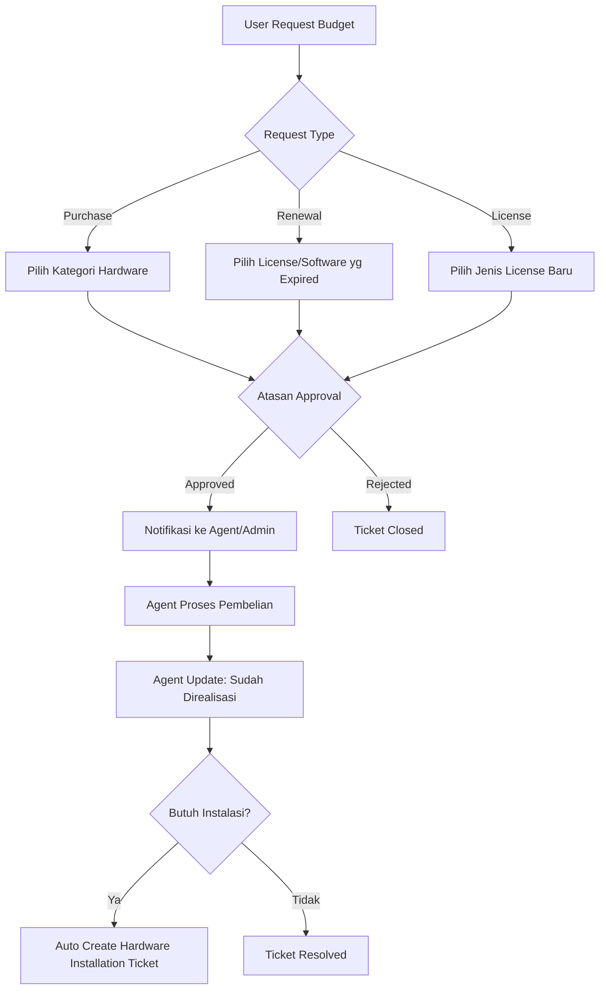

# iDesk Major Upgrade - Design Plan

> **Version**: 1.1  
> **Date**: 2025-12-11  
> **Status**: Updated with User Clarifications ✅

---

## 📋 Executive Summary

Dokumen ini menjelaskan rencana upgrade besar untuk sistem iDesk yang mencakup:
- 5 perubahan pada sistem ticket
- 2 fitur baru (Sound Notification & Synology Backup)
- Sistem multi-site dengan **strict site isolation** (SPJ, SMG, KRW, JTB)

---

## ✅ User Clarifications Applied

| # | Question | Answer |
|---|----------|--------|
| 1 | ICT Budget Categories | **Universal** - bisa untuk renewal atau pembelian license juga |
| 2 | Access Types | WiFi, VPN, Website (cukup untuk saat ini) |
| 3 | Default Site | **SPJ (Sepanjang)** - server berada di SPJ |
| 4 | Manager Assignment | Hanya Administrator yang dapat set role, untuk testing: 1 Manager + 1 Admin |
| 5 | Synology Model | **RS1221** (RackStation) |
| 6 | Sound Preferences | **Default + Custom** - Admin dapat upload sound sendiri |

---

## 🎫 Part 1: Ticket System Changes

### 1.1 ICT Budget Realization Ticket (Universal)

**Konsep**: Menu untuk request realisasi budget ICT - **bisa untuk pembelian perangkat baru, renewal, atau pembelian license**.

#### Budget Categories (Universal)
| Category | Type | Examples |
|----------|------|----------|
| Hardware Purchase | PURCHASE | PC, Laptop, Printer, Monitor, dll |
| License Purchase | LICENSE | Microsoft 365, Adobe, Antivirus |
| License Renewal | RENEWAL | Perpanjangan license yang sudah ada |
| Software Renewal | RENEWAL | Maintenance, Support Agreement |
| Network Equipment | PURCHASE | Switch, Router, Access Point |
| Others | CUSTOM | Kategori custom |

#### Database Schema
```sql
-- New fields in tickets table
ALTER TABLE tickets ADD COLUMN ticket_type VARCHAR(50) DEFAULT 'SERVICE';
-- Values: SERVICE, ICT_BUDGET, LOST_ITEM, ACCESS_REQUEST, HARDWARE_INSTALLATION

-- Universal ICT Budget table
CREATE TABLE ict_budget_requests (
    id UUID PRIMARY KEY,
    ticket_id UUID REFERENCES tickets(id),
    
    -- Universal categories
    request_type VARCHAR(20),            -- PURCHASE, RENEWAL, LICENSE
    budget_category VARCHAR(100),        -- PC, Laptop, License, dll
    item_name VARCHAR(255),              -- Nama spesifik item/license
    vendor VARCHAR(255),                 -- Vendor/distributor jika ada
    
    -- Financials
    estimated_amount DECIMAL(15,2),
    quantity INTEGER DEFAULT 1,
    renewal_period_months INTEGER,       -- Untuk renewal: berapa bulan
    current_expiry_date DATE,            -- Untuk renewal: tanggal expired saat ini
    
    -- Request details
    justification TEXT,
    urgency_level VARCHAR(20),           -- NORMAL, URGENT
    
    -- Approval workflow
    superior_id UUID REFERENCES users(id),
    superior_approved_at TIMESTAMP,
    superior_notes TEXT,
    
    -- Realization
    realization_status VARCHAR(50),      -- PENDING, APPROVED, PURCHASING, REALIZED
    realized_by_id UUID REFERENCES users(id),
    realized_at TIMESTAMP,
    realization_notes TEXT,
    purchase_order_number VARCHAR(100),
    invoice_number VARCHAR(100),
    
    -- For hardware purchase - link to hardware installation
    requires_installation BOOLEAN DEFAULT FALSE,
    linked_hw_ticket_id UUID,
    
    created_at TIMESTAMP DEFAULT NOW()
);
```

#### Workflow


---

### 1.2 Lost Item Report Ticket

**Konsep**: Form pelaporan kehilangan barang dengan detail lengkap.

#### Database Schema
```sql
CREATE TABLE lost_item_reports (
    id UUID PRIMARY KEY,
    ticket_id UUID REFERENCES tickets(id),
    item_type VARCHAR(100),             -- Laptop, HP, ID Card, Kunci, dll
    item_name VARCHAR(255),
    serial_number VARCHAR(100),
    asset_tag VARCHAR(50),
    last_seen_location TEXT,
    last_seen_datetime TIMESTAMP,
    circumstances TEXT,
    witness_contact TEXT,
    has_police_report BOOLEAN DEFAULT FALSE,
    police_report_number VARCHAR(100),
    police_report_file VARCHAR(255),
    estimated_value DECIMAL(15,2),
    finder_reward_offered BOOLEAN DEFAULT FALSE,
    status VARCHAR(50),                 -- REPORTED, SEARCHING, FOUND, CLOSED_LOST
    found_at TIMESTAMP,
    found_location TEXT,
    found_by VARCHAR(255),
    created_at TIMESTAMP DEFAULT NOW()
);
```

---

### 1.3 Access Request Ticket (WiFi, VPN, Website)

**Konsep**: Request akses dengan form TTD atasan dan user.

#### Database Schema
```sql
CREATE TABLE access_types (
    id UUID PRIMARY KEY,
    name VARCHAR(100),                  -- WiFi, VPN, Website
    form_template_url VARCHAR(255),
    requires_superior_signature BOOLEAN DEFAULT TRUE,
    requires_user_signature BOOLEAN DEFAULT TRUE,
    validity_days INTEGER,
    description TEXT,
    site_id UUID REFERENCES sites(id)   -- Per-site form templates
);

CREATE TABLE access_requests (
    id UUID PRIMARY KEY,
    ticket_id UUID REFERENCES tickets(id),
    access_type_id UUID REFERENCES access_types(id),
    requested_access TEXT,
    purpose TEXT,
    valid_from DATE,
    valid_until DATE,
    form_generated_at TIMESTAMP,
    form_downloaded_at TIMESTAMP,
    signed_form_url VARCHAR(255),
    signed_form_uploaded_at TIMESTAMP,
    verified_by_id UUID REFERENCES users(id),
    verified_at TIMESTAMP,
    verification_notes TEXT,
    access_created_at TIMESTAMP,
    access_credentials TEXT,
    status VARCHAR(50),
    created_at TIMESTAMP DEFAULT NOW()
);
```

---

### 1.4 Priority SLA Display Changes

- Hilangkan tampilan jam SLA pada form create ticket
- Field "Alasan Critical" **WAJIB** diisi hanya untuk priority CRITICAL

```sql
ALTER TABLE tickets ADD COLUMN critical_reason TEXT;
```

---

### 1.5 Priority Weighting & Auto-Assignment System

| Priority | Points |
|----------|--------|
| LOW | 1 |
| MEDIUM | 2 |
| HIGH | 4 |
| CRITICAL | 8 |
| HARDWARE_INSTALLATION | 3 |

```sql
CREATE TABLE priority_weights (
    id UUID PRIMARY KEY,
    priority VARCHAR(50) UNIQUE,
    points INTEGER NOT NULL,
    updated_at TIMESTAMP DEFAULT NOW()
);

CREATE TABLE agent_daily_workload (
    id UUID PRIMARY KEY,
    agent_id UUID REFERENCES users(id),
    site_id UUID REFERENCES sites(id),
    work_date DATE,
    total_points INTEGER DEFAULT 0,
    active_tickets INTEGER DEFAULT 0,
    last_assigned_at TIMESTAMP,
    UNIQUE(agent_id, site_id, work_date)
);
```

---

## 🔔 Part 2: New Features

### 2.1 Sound Notifications (Customizable)

#### Sound Configuration
```sql
CREATE TABLE notification_sounds (
    id UUID PRIMARY KEY,
    event_type VARCHAR(50),             -- new_ticket, assigned, resolved, critical, message
    sound_name VARCHAR(100),
    sound_url VARCHAR(255),             -- /uploads/sounds/custom.mp3
    is_default BOOLEAN DEFAULT FALSE,
    is_active BOOLEAN DEFAULT TRUE,
    uploaded_by_id UUID REFERENCES users(id),
    created_at TIMESTAMP DEFAULT NOW()
);

-- Default sounds seeded at migration
INSERT INTO notification_sounds (event_type, sound_name, sound_url, is_default) VALUES
('new_ticket', 'New Ticket Alert', '/sounds/default/new-ticket.mp3', true),
('assigned', 'Ticket Assigned', '/sounds/default/assigned.mp3', true),
('resolved', 'Ticket Resolved', '/sounds/default/resolved.mp3', true),
('critical', 'Critical Alert', '/sounds/default/critical-alert.mp3', true),
('message', 'New Message', '/sounds/default/message.mp3', true);
```

#### Admin Sound Upload
- Admin dapat upload file .mp3/.wav
- Pilih event mana yang pakai sound tersebut
- Preview sound sebelum save
- Restore ke default

---

### 2.2 Synology RS1221 Integration & Auto Backup

#### Synology RS1221 Specifications
- 8-bay RackStation
- DSM 7.x support
- API: Synology Web API

#### Configuration Schema
```sql
CREATE TABLE backup_configurations (
    id UUID PRIMARY KEY,
    name VARCHAR(100),
    synology_host VARCHAR(255),
    synology_port INTEGER DEFAULT 5001,         -- HTTPS port
    synology_protocol VARCHAR(10) DEFAULT 'https',
    synology_username VARCHAR(100),
    synology_password_encrypted TEXT,
    destination_volume VARCHAR(50),             -- volume1, volume2
    destination_folder VARCHAR(255),            -- /iDesk-Backups
    backup_type VARCHAR(20),                    -- DATABASE, FILES, FULL
    schedule_cron VARCHAR(100),
    retention_days INTEGER DEFAULT 30,
    is_active BOOLEAN DEFAULT TRUE,
    last_backup_at TIMESTAMP,
    last_backup_status VARCHAR(50),
    last_backup_size_bytes BIGINT,
    created_at TIMESTAMP DEFAULT NOW()
);

CREATE TABLE backup_history (
    id UUID PRIMARY KEY,
    config_id UUID REFERENCES backup_configurations(id),
    started_at TIMESTAMP,
    completed_at TIMESTAMP,
    status VARCHAR(50),
    backup_type VARCHAR(20),
    file_path VARCHAR(255),
    file_size_bytes BIGINT,
    error_message TEXT,
    created_at TIMESTAMP DEFAULT NOW()
);
```

#### Synology API Endpoints Used
```typescript
// DSM 7.x Web API
const SYNOLOGY_API = {
    auth: 'SYNO.API.Auth',
    fileStation: 'SYNO.FileStation',
    storage: 'SYNO.Storage.CGI.Storage'
};

@Injectable()
export class SynologyService {
    async login(host: string, user: string, pass: string): Promise<string>;
    async getStorageInfo(): Promise<VolumeInfo[]>;
    async listFolders(volume: string): Promise<Folder[]>;
    async createFolder(path: string): Promise<void>;
    async uploadFile(localPath: string, remotePath: string): Promise<void>;
    async deleteOldBackups(retentionDays: number): Promise<void>;
}
```

---

## 🌐 Part 3: Multi-Site System (Strict Isolation)

### 3.1 Site Isolation Rules

> [!IMPORTANT]
> **Strict Site Isolation**: User dan Agent **HANYA BISA** melihat data dari site mereka sendiri.

| Role | Site Access | Notes |
|------|-------------|-------|
| USER | **Own site only** | User SPJ tidak bisa lihat/report ke SMG |
| AGENT | **Own site only** | Agent SPJ tidak bisa handle ticket SMG |
| ADMIN | **All sites** | Bisa lihat & manage semua site |
| MANAGER | **All sites** | Cross-site visibility & reports |

#### Database Schema
```sql
CREATE TABLE sites (
    id UUID PRIMARY KEY,
    code VARCHAR(10) UNIQUE,            -- SPJ, SMG, KRW, JTB
    name VARCHAR(100),
    description TEXT,
    vpn_ip_range VARCHAR(50),
    local_gateway VARCHAR(50),
    timezone VARCHAR(50) DEFAULT 'Asia/Jakarta',
    is_active BOOLEAN DEFAULT TRUE,
    is_server_host BOOLEAN DEFAULT FALSE,  -- TRUE for SPJ
    created_at TIMESTAMP DEFAULT NOW()
);

-- Seed sites
INSERT INTO sites (code, name, is_server_host) VALUES
('SPJ', 'Sepanjang', TRUE),
('SMG', 'Semarang', FALSE),
('KRW', 'Karawang', FALSE),
('JTB', 'Jakarta', FALSE);

-- Add site_id to existing tables
ALTER TABLE users ADD COLUMN site_id UUID REFERENCES sites(id);
ALTER TABLE tickets ADD COLUMN site_id UUID REFERENCES sites(id);
ALTER TABLE departments ADD COLUMN site_id UUID REFERENCES sites(id);
```

### 3.2 Site-Aware Query Guards

```typescript
// Site isolation decorator
@Injectable()
export class SiteGuard implements CanActivate {
    canActivate(context: ExecutionContext): boolean {
        const user = context.switchToHttp().getRequest().user;
        
        // ADMIN & MANAGER can access all sites
        if (['ADMIN', 'MANAGER'].includes(user.role)) {
            return true;
        }
        
        // USER & AGENT can only access their site
        const requestedSiteId = context.getRequest().params.siteId 
            || context.getRequest().query.siteId;
        
        if (requestedSiteId && requestedSiteId !== user.siteId) {
            throw new ForbiddenException('Cannot access other site data');
        }
        
        return true;
    }
}

// Auto-inject site filter in queries
@Injectable()
export class TicketQueryService {
    async findAll(user: User, filters: TicketFilters) {
        const qb = this.repo.createQueryBuilder('ticket');
        
        // Apply site isolation
        if (!['ADMIN', 'MANAGER'].includes(user.role)) {
            qb.andWhere('ticket.site_id = :siteId', { siteId: user.siteId });
        } else if (filters.siteIds?.length) {
            qb.andWhere('ticket.site_id IN (:...siteIds)', { siteIds: filters.siteIds });
        }
        
        return qb.getMany();
    }
}
```

### 3.3 Frontend Site Isolation

```tsx
// User/Agent view - NO site selector (automatically filtered)
const TicketList = () => {
    const { user } = useAuth();
    
    // Query automatically filters by user's site
    const { data } = useQuery(['tickets'], () => api.get('/tickets'));
    
    // User cannot see site column
    return <Table data={data} columns={getUserColumns()} />;
};

// Admin/Manager view - HAS site selector
const AdminTicketList = () => {
    const { user } = useAuth();
    const [selectedSites, setSelectedSites] = useState<string[]>([]);
    
    return (
        <>
            <SiteFilter 
                selectedSites={selectedSites}
                onChange={setSelectedSites}
            />
            <Table 
                data={data} 
                columns={getAdminColumns()} // Includes site column
            />
        </>
    );
};
```

---

### 3.4 Manager Dashboard Layout

```
┌─────────────────────────────────────────────────────────────────────┐
│  MANAGER DASHBOARD                              [Site: All ▼]       │
├─────────────────────────────────────────────────────────────────────┤
│  ┌─────────────┐ ┌─────────────┐ ┌─────────────┐ ┌─────────────┐   │
│  │  TOTAL      │ │  OPEN       │ │  CRITICAL   │ │  SLA        │   │
│  │  TICKETS    │ │  TICKETS    │ │  TICKETS    │ │  BREACH     │   │
│  │    156      │ │     42      │ │      8      │ │     3       │   │
│  │  +12 today  │ │  SPJ:15     │ │  🔴 Alert   │ │  ⚠️ Warning │   │
│  │             │ │  SMG:12     │ │             │ │             │   │
│  │             │ │  KRW:8      │ │             │ │             │   │
│  │             │ │  JTB:7      │ │             │ │             │   │
│  └─────────────┘ └─────────────┘ └─────────────┘ └─────────────┘   │
│                                                                     │
│  ┌────────────────────────────────┐ ┌────────────────────────────┐ │
│  │  TICKET DISTRIBUTION PER SITE  │ │  TOP AGENTS (This Month)   │ │
│  │  [Bar Chart: SPJ|SMG|KRW|JTB]  │ │  1. 🥇 Budi (SMG) - 45 tix │ │
│  └────────────────────────────────┘ │  2. 🥈 Andi (SPJ) - 42 tix │ │
│                                     │  3. 🥉 Dewi (KRW) - 38 tix │ │
│  ┌────────────────────────────────┐ └────────────────────────────┘ │
│  │  TOP USERS (Most Tickets)      │ ┌────────────────────────────┐ │
│  │  1. IT Dept SPJ - 28 tickets   │ │  TREND (Last 7 Days)       │ │
│  │  2. Finance SMG - 22 tickets   │ │  [Line Chart per Site]     │ │
│  └────────────────────────────────┘ └────────────────────────────┘ │
│                                                                     │
│  ┌──────────────────────────────────────────────────────────────┐  │
│  │  RECENT CRITICAL TICKETS                                      │  │
│  │  ┌Site─┬─Title──────────────────────┬Status┬Agent─┬Time──┐   │  │
│  │  │ SPJ │ Server Down Production     │ 🔴   │ Andi │ 2h   │   │  │
│  │  │ SMG │ Network Outage Floor 3     │ 🟡   │ Budi │ 4h   │   │  │
│  │  │ KRW │ Database Connection Failed │ 🟢   │ Dewi │ 6h   │   │  │
│  │  └─────┴────────────────────────────┴──────┴──────┴──────┘   │  │
│  └──────────────────────────────────────────────────────────────┘  │
└─────────────────────────────────────────────────────────────────────┘
```

---

### 3.5 Manager Telegram Integration

```
🏢 MANAGER MENU (@iDeskManagerBot)

📊 /dashboard - Overview semua site
📋 /site [code] - Quick view per site
🔔 /alerts - Critical alerts setting
📈 /report [daily|weekly] - Quick reports
```

---

### 3.6 Multi-Site Reports

| Report Type | Description |
|-------------|-------------|
| Consolidated | Gabungan semua site dalam 1 PDF |
| Per Site | Report terpisah untuk tiap site |
| Custom | Pilih kombinasi sites |
| Comparison | Perbandingan antar site |

---

## 📁 Implementation Structure

### New Backend Modules
```
src/modules/
├── sites/                      # Site management
├── ict-budget/                 # ICT Budget Realization
├── lost-item/                  # Lost Item Reports
├── access-request/             # Access Request (WiFi/VPN)
├── synology/                   # Synology RS1221 integration
├── workload/                   # Agent workload & auto-assign
├── sound/                      # Custom sound management
└── manager/                    # Manager dashboard & reports
```

### New Frontend Pages
```
src/features/
├── manager/
│   ├── pages/
│   │   ├── ManagerDashboard.tsx
│   │   └── ManagerReportsPage.tsx
│   └── components/
│       ├── SiteSelector.tsx
│       └── MultiSiteChart.tsx
├── settings/
│   ├── SoundSettingsPage.tsx
│   └── StorageSettingsPage.tsx
└── ticket-board/
    └── components/
        ├── IctBudgetForm.tsx
        ├── LostItemForm.tsx
        └── AccessRequestForm.tsx
```

---

## ✅ Verification Plan

### Automated Tests
```bash
cd apps/backend
npm run test -- --grep "site-isolation|ict-budget|auto-assign"
```

### Manual Testing
1. **Site Isolation**: Login as User SPJ → Verify cannot see SMG tickets
2. **ICT Budget Flow**: Create renewal request → Approval → Realization
3. **Auto-Assignment**: Create tickets → Verify balanced distribution per site
4. **Synology Backup**: Connect RS1221 → Schedule backup → Verify files
5. **Sound Notifications**: Upload custom sound → Trigger event → Verify

---

## 📋 Migration Steps

1. Create `sites` table & seed SPJ, SMG, KRW, JTB
2. Add `site_id` to users, tickets, departments
3. Set SPJ as default site for existing data
4. Create MANAGER role
5. Deploy modules incrementally
6. Configure Synology RS1221

